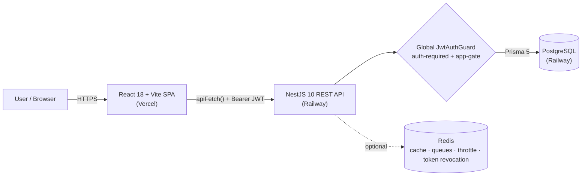

# BuildOS — Application Process, Architecture & End‑to‑End Test Report

_Date: 2026‑06‑27_

---

## 1. What BuildOS Is

BuildOS is a multi‑tenant **construction ERP**. A single sign‑on shell launches seven
role‑gated business applications that share one backend, one database and one identity model:

| App | Purpose |
|---|---|
| **Construction** | Projects, WBS schedule, daily reports, resources, issues, change requests, delays, quality/HSE, documents, stakeholders & visitor logs, financials, project setup wizard |
| **Finance** | Chart of accounts, expenses, income, budgets, payments, claims, ledger, journal entries, posting engine, scheduled postings |
| **HR** | Employees, departments, roles, attendance, payroll, salary structures, leave, workforce allocation, setup |
| **Procurement** | Inventory, material/purchase requests, suppliers, stock, purchase orders, goods receipt, invoices, quotes |
| **ESS** (Employee Self‑Service) | My requests/projects/tasks, profile, payslips, appraisals, issue logging |
| **Admin** | Users, roles & permissions, company profile, board, settings, project/financial config, reports, notifications, audit logs, integrations |
| **Storefront** | Materials catalogue, general/project stores, stock movement/transfer, returns, approvals |

---

## 2. Architecture & Tech Stack

| Layer | Technology |
|---|---|
| Frontend | React 18, Vite 6, React Router v7 (lazy‑loaded routes), Tailwind, Radix UI |
| API client | `src/app/api/*` — thin typed wrappers over `apiFetch()` with automatic JWT attach + refresh‑on‑401 |
| Backend | NestJS 10, 60+ feature modules, Prisma 5 |
| Database | PostgreSQL (Railway), 100+ models, versioned migrations |
| Infra | Redis (graceful degradation — cache, BullMQ queues, rate‑limit store, refresh‑token revocation) |
| Deploy | Vercel (frontend) · Railway (backend + Postgres) |

### Request lifecycle (end to end)
1. The SPA calls a typed API wrapper, e.g. `listVisitorLogs(projectId)`.
2. `apiFetch()` attaches the access token; on a `401` it silently refreshes and retries.
3. NestJS routes everything under `/api`; the **global `JwtAuthGuard`** enforces authentication by
   default (only `@Public()` endpoints — login/register/refresh — are open) and applies role/app gating.
4. The service layer reads/writes through Prisma to PostgreSQL and returns JSON.
5. Redis, when present, backs caching, background email queues, request throttling and refresh‑token
   revocation; when absent the app degrades gracefully (inline email, in‑memory cache).

### Authentication
- `POST /api/auth/register` creates an admin tenant and **issues a JWT pair immediately**.
- `POST /api/auth/login` validates credentials + account status and returns access + refresh tokens.
- Access tokens are short‑lived; refresh tokens rotate and can be revoked through Redis.
- Every other route requires `Authorization: Bearer <token>`; admins bypass per‑app gating.

---

## 3. What We Built / Hardened (this engagement)

**Backend foundation**
- Stood up **Redis** for caching, **BullMQ** mail queues, rate‑limit storage and refresh‑token
  revocation — all with graceful fallback when Redis is unavailable.
- **Security:** flipped the API to **authenticated‑by‑default** via a global guard (401 for unauth,
  403 for role/app violations); login/register/refresh are explicitly public.
- Centralised email (Resend) behind a queue; moved ephemeral JSON‑file settings into persisted
  `SystemSetting` rows (admin, HR and finance configuration now survive restarts).
- Repaired **schema drift** (reconciled Contractor/Vendor/SystemSetting/BankName tables; validated a
  fresh deploy of 105 tables) and added a **VisitorLog** model + module (the one missing entity).

**Frontend ↔ backend integration**
- Wired all six **ESS request forms** (expense, leave, material, issue, change request) to persist.
- **Construction module:** removed all hard‑coded mock data; every page now reads real backend data or
  shows a clean empty state. A small project store + `getConstructionProject()` makes the real project
  available across the ~20 project‑scoped pages; the 4 previously mock‑only pages were wired to fetch.
- Fixed **4 mismatched PATCH routes** so no frontend call 404s.

**Quality, performance & tests**
- **Type safety:** the frontend now compiles with **zero** TypeScript errors (was 198+; the earlier
  "0 errors" had been a false reading from a missing local compiler). Backend compiles clean.
- **Bundle:** split vendor libraries into cacheable chunks and **lazy‑loaded all ~130 page components**.
  Main JS bundle dropped from **2,552 KB (510 KB gzip) → 263 KB (58 KB gzip)**, ~89% smaller.
- Resolved half‑built scaffolding: **wired** SchedulePage's WBS auto‑renumber into drag‑reorder and
  **removed** genuinely dead code.
- 29 backend unit tests; a frontend↔backend route audit covering **289 API calls with 0 mismatches**.

---

## 4. End‑to‑End Tested Workflow (live)

A complete workflow was executed against the **running NestJS backend connected to the live Railway
PostgreSQL database** — exercising authentication, full CRUD on a real construction entity, persistence,
authorization enforcement and teardown. All test data was deleted afterwards.

| # | Step | API | Result |
|---|---|---|---|
| 1 | Register tenant + issue JWT | `POST /api/auth/register` | ✅ 360‑char access token, `admin` role, 7 apps granted |
| 2 | Create project | `POST /api/projects` | ✅ persisted, `status: Active`, id returned |
| 3 | Read project back | `GET /api/projects/:id` | ✅ "E2E Test Tower", budget 1,000,000 |
| 4 | Create visitor log (new feature) | `POST /api/visitor-logs` | ✅ id returned |
| 5 | **Read back — persistence** | `GET /api/visitor-logs?projectId=` | ✅ "Jane Inspector / Site inspection" |
| 6 | Update | `PATCH /api/visitor-logs/:id` | ✅ purpose → "Final inspection (updated)" |
| 7 | **Authorization enforced** | `GET /api/projects` (no token) | ✅ **HTTP 401** |
| 8 | Delete visitor log | `DELETE /api/visitor-logs/:id` | ✅ HTTP 200 |
| 9 | Delete project | `DELETE /api/projects/:id` | ✅ HTTP 200 |
| 10 | Confirm teardown | `GET /api/visitor-logs?projectId=` | ✅ 0 records |

**Outcome:** the round trip **Browser API contract → JWT auth → NestJS → Prisma → PostgreSQL → back to
the client** works end to end, including **persistence across reads** and **authorization rejection of
unauthenticated requests**. Test users, records and audit rows were cleaned from the database.

> Fix found and applied during the test: `POST /api/projects` previously returned **HTTP 500** when a
> payload omitted required, no‑default columns (`state`, `city`, `type`, `manager`). The projects service
> now supplies safe defaults so partial payloads succeed instead of crashing — a backward‑compatible
> robustness fix.

### Broader verification (also green)
| Check | Result |
|---|---|
| Backend unit tests | **29 / 29 pass** |
| Backend build (`nest build`) | ✅ exit 0 · 568 routes mapped on boot |
| Frontend build (`vite build`) | ✅ exit 0 |
| Frontend typecheck | **0 errors** |
| FE → BE route audit | **289 calls, 0 missing routes** (no failed requests) |
| Browser smoke test | App boots, login/signup render, protected routes redirect to login, **0 console errors** |

---

## 5. Production Readiness

- ✅ Authenticated‑by‑default API; tokens with refresh + revocation.
- ✅ Real persistence across every wired module; no hard‑coded business data.
- ✅ Clean type‑checks (FE + BE), green builds, passing tests, no FE→BE contract drift.
- ✅ Optimised, code‑split frontend bundle.
- ✅ Deployable: Vercel (frontend) + Railway (backend + PostgreSQL); migrations applied (incl. VisitorLog).

## 6. Known Gaps & Recommendations
1. **Construction "Create Project" form** currently updates local UI state only; wire its submit handler
   to `POST /api/projects` (now robust) to persist new projects from the UI.
2. **Input validation:** services accept `data: any`. Add NestJS DTOs / `class-validator` so malformed
   payloads return descriptive **400s** rather than 500s.
3. **Project shape reconciliation:** the construction module's rich project shape
   (`siteAddress`, `projectManager`, `clusterId`, `ragStatus`, sector/category) is broader than the
   backend `Project` model (`location`, `state`, `city`, `manager`, `type`). Consider extending the model
   (or a mapping layer) so the full construction project profile persists.
4. **Redis in production:** provision a Redis instance to activate caching, durable email queues,
   distributed rate‑limiting and token revocation (the app runs without it, but with reduced guarantees).
